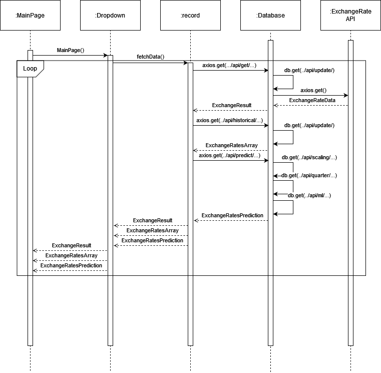
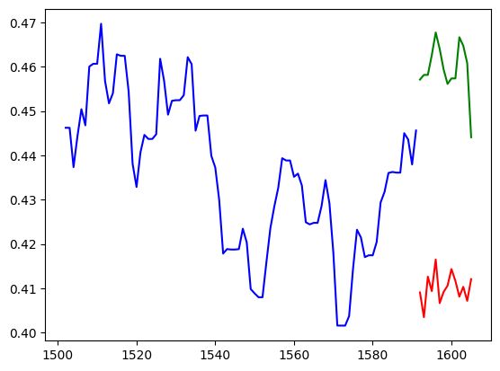
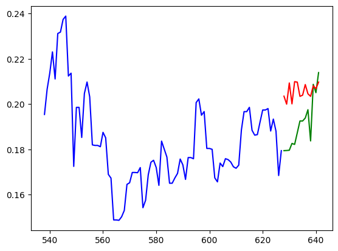
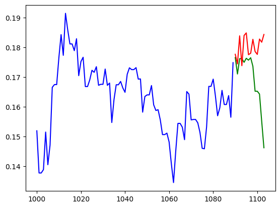
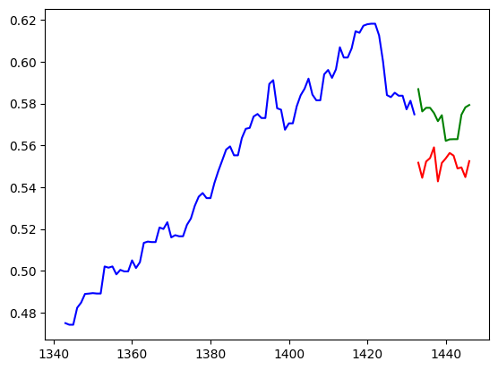

# TechEx

## Background, Motivation and Scope

Given the state of the U.S economy, Americans are looking away from the stock and bond market as an avenue to growing their retirement fund. What many people don’t know is that exchange rates can be utilized in this exact fashion in order to make a profit – albeit with a lot more personal involvement. The goal of our application, TechEX, is to streamline this process of “currency hopping” by providing machine learning (ML) models in order to better project the transactions needed to maximize profit. At its base, the application will be able to execute simple exchange rate commands and display historical data. The addition of the ML models takes a simple single page web application to the next level in terms of complexity and work required.  As students, we aim to expand upon the topics explored in project 1 (software development lifecycle, common production tools/technologies for web development, as well as professional teamwork and communication) while also exploring machine learning as both a technology and concept.  

## Project Management
Our project management tool of choice, Zenhub, adds a Kanban board structure to GitHub. It allows for GitHub bugs and stories to be connected to the board and displayed in a visual fashion. We have been meeting once a week via Microsoft Teams to update each other on our progress, and usually text each other multiple times a day when small things come up.

In general, we've had relativily flexible responsibilities given our scattered expertise. Below is a table summarizing our individual roles:

| Team Member Name | Roles |
| ----------- | ----------- |
| Scott Janssen | Backend Engineer, QA Lead, Project Manager |
| Summer Sneed | Frontend Engineer, UI Lead |
| Sam Lee | Backend Engineer, Algorithms Expert |
| Balaram Behera | Frontend Engineer, ML Expert, Requirements Lead |

Note that these roles are not static. Team members are expected to contribute whereever needed, especially if they are proficient in areas that they are not focussed on for this project.

## Literature Review
Foreign exchange trading (Forex) is already a widespread idea in the financial world. There are hundreds, if not thousands, of platforms that allow for the manual trading of currencies. In addtion, after careful research, we found a trading platform that does exactly what we're attempting to do, with more features and functionalities, as well as a clean design. 

[Oanda Metatrader 4](https://www.oanda.com/us-en/trading/platforms/metatrader-4/) is the platform we found. It includes the ability to build trading algorithms, backtest your trading strategies and use existing algorithms to make a profit. While our implementation will not surpass this professional product, it certaintly will be a prime learning opportunity, which is all we can ask for a students.

## Software Technologies
To create TechEx, we decided to follow the MERN (Mongo, Express, React and Node) stack. There are several reasons why we chose this stack over our previous usage of Java and React. Firstly, all of the separate MERN technologies work exceptionally well together. It's very easy to connect a Mongo database to an Express backend, and Express integrates well with a React frontend given that they are written in the same language. The second reason for using MERN over another grouping of technologies is that the frontend and backend are both written in JavaScript. This makes it significantly easier for us as students to work efficiently in a short timeframe. Additionally, Mongo is very easy to use out of the box and provides an interactive UI to help inexperienced developers understand the workings of a basic database system. 

For our machine learning prediction, we used a iPython Notebook on Jupyter using Python 3.10.2.
We used the following Python libraries for data preparation and training: NumPy, Pandas, and Tensorflow.
We particularly used Keras provided by Tensorflow and used the in-built LSTM, Dense, and Dropout layers.
To deploy our model, we used TensorflowJS (TF.js).

To display historical data and prediction trends, we used the D3.js library to create an interactive chart with tooltips and time range functionality.


As of writing this report, we plan on deploying our application to Google App Engine.

## Project Lifecycle
Given the short time given to plan, design and execute this project, we've had to move quickly with little or no time for iteration. With this in mind, we've mostly followed a waterfall based lifecycle for the duration of development. The first week consisted of cementing our ideas, choosing technologies and writing some barebones code. Weeks 2-4 have been dedicated to writing code for our application, running ML models and creating tests to verify our design. The final week will be dedicated to making any finishing touches, deploying our application and writing any documentation required.

## Requirements

### Functional
The system should allow the user to convert an inputted amount between two different currencies.
The system should allow the user to see a trading scenario depending on their currency of choice.
The system should allow the user to click between different trading scenarios.
The system should allow the user to view the exchange rate between USD and EUR currencies over a period of time.

### Non-Functional
The system may allow the user to see predicted exchange rates from a machine learning algorithm.
The system may allow users fast updates of exchange rates when they are loaded from the database.


## Design
Our system can be broken down into three major components: web server, javascript application server, and the user database.  

The web server is where the user solely interacts with the application. Users can perform all application actions here using a GUI, including switching different exchange rates or typing the amount of currency they want to exchange. The logistics of these actions occur in the javascript application server, which will be discussed next. 

The javascript application server handles and verifies all requests by the user. Its position is unique in that it connects the full application together: having both access to the web server and the exchange rate database. Its main job is to move and process data between the web server and the database. For this application, it includes processing exchange rates stored in the database, passing the exchange rates to the web server, and updating and maintaining the database to store new exchange rates per date. 

The user database is where information about all the fetched exchange rates are permanently stored. It fully interacts with the java application server to move data to and from the database. All our exchange rate data are stored here and can be passed back to the javascript application server for processing. 

### Low Level Design Diagrams





### Exchange Rates Prediction with Machine Learning
In order to predict exchange rates into the future, we train a machine learning model that is able to accomplish this task both accurately and reasonably.
We use Recurrent Neural Networks (RNNs) for our model which are able to capture temporal features.
We wish to predict 90 days of historic data 14 days into the future, so this would require a many-to-many RNN.
Past research has shown the effectiveness of LSTMs (Long short-term memory units) for FOREX and stock prediction as rates are greatly influenced by their recent states and also the general patterns of the market.

In order to create the training dataset, we only focus on the top 35 traded currencies, in terms of traded volume (sourced from Wikipedia).
Using our API we then downloaded all historical data on these currencies since January 1st, 1999.
We then computed the exchange rates between every currency (approx. 1100) over the last 23 years where we assumed transitivity as we are using daily exchange rate values.
All the data was then normalized to a 0-1 scale using the minimum and maximum of each respective exchange rate.
We then uniformly sampled 200,000 periods of 104 days from all the possible 104 day periods, and used that as our training set.
We used the first 90 days as our training input and the second 14 days as our training label.
We conducted this sampling to reduce the computation time of training, and in our tests, under samples of 50,000, 100,000, and 300,000, the model's results were similar in accuracy and loss.

We used TensorFlow to create our sequential model which had the following layout.

1. Input layer of size 90
2. LSTM Layer of 64 units and a dropout of 20%
3. LSTM Layer of 64 units and a dropout of 20%
4. LSTM Layer of 64 units and a dropout of 20%
5. Dense Layer of 32 units and a dropout of 40%
6. Dense Layer of 14 units for the output

We also write the code below:
```
model = Sequential()

model.add(LSTM(units=64, return_sequences=True, input_shape=(input_timeframe, 1)))
model.add(Dropout(0.2))

model.add(LSTM(units=64, return_sequences=True))
model.add(Dropout(0.2))

model.add(LSTM(units=64))
model.add(Dropout(0.2))

model.add(Dense(units=32))
model.add(Dropout(0.4))

model.add(Dense(units=output_timeframe))

model.summary()
```
The LSTM layers are able to capture the recurrent features and the last dense layers assemble the many-to-many output of 14 days of predicted data.

We trained this model using the Adam optimizer which is a standard tool for RNNs along with the loss of Mean-Squared Error (MSE).
As we are predicting trendlines, MSE is known to reflect the accuracy well.
However, with many different types of patterns being trained on the same model, it can tend to train the model toward an average which is usually a flat line (the rates remain the same) rather than predicting an exciting trend.
Although these flat lines are reasonable, they do not provide any new information; hence, we considered those results as a sign of overfitting.
In order to limit speedy overfitting, we utilized batch training with a batch size of 2048 (approx. 100 batches).
This then reduced the number of epochs we needed to train to only 3 before the model overfitted.
```
model.compile(optimizer=Adam(learning_rate=0.001), loss='mean_squared_error')
model.fit(X_train, y_train, epochs=3, batch_size=2048)
```

Our final results on testing data (data not used for training) are shown below.







Although with more training both our training and testing loss would decrease we argue that since that only resulted in more flat-lines we were still overfitting to a theoretical average pattern (where most rates would eventually even out after some time rather than only increase or decrease).
We neglected a case like this as our cost function of MSE is not able to codify a good model predictor according to our needs.
With our training procedures, we received similar training and testing loss values which indicates no overfitting or underfitting as required.
Moreover, we recognized a small bias in predicting a bear-ish trend (going down), and we suspect this to be a result of the general pattern of decreases in exchange rates lasting longer than increases.
We deployed our model on our application using TensorflowJS.

## Testing

### Blackbox Testing
For Blackbox testing, we wanted to implement realistic, functional tests that mirrored what users would actually experiences when using our application. In order to achieve this, we needed to find a complex testing framework that can mimic those actions. Enter the Cypress testing framework. Cypress is a JavaScript based library that relies on HTML ids and classnames to perform actions on UI elements. For example, using Cypress, a developer could automate writing in a specific textbox and comparing the result to an expected one. Similar principles can be applied to our own application. Below is a table describing all cypress tests performed

| Test Name | Description |
| ----------- | ----------- |
| Null Currencies Check | Cypress automates the conditional case in the event that a currency exchange is attempted to be made without selecting a currency to start and/or end from. In the event this occurs, the UI should return a result of: "Error: Cannot have null currencies" |
| 0 Value Check | Cypress automates the conditional case in the event that a currency exchange is attempted to be made, but, a value of 0 is inputted as the value to translate. In the event this occurs, the UI should return a result of: "Error: Cannot have a zero value" |
| Negative Value Check | Cypress automates the conditional case in the event that a currency exchange is attempted to be made, but, a negative value is inputted as the value to translate. In the event this occurs, the UI should return a result of: "Error: Cannot have a negative value" |
| Correct Value Check | Cypress automates the conditional case in the event that a correct currency exchange is performed. In order for a currency exchange to be proper, a start and end curency must be selected, and the value of conversion must be positive (but not zero). In the event all of these occur, the test will pass. |

### Whitebox Testing

Given the purpose of our application, whitebox testing is a bit more difficult. It is hard to test the effectiveness of ML applications, and even harder to test the dynamics of using ML within an application. What we can do, however, is test the validity of our backend endpoints. We have two types so far: convert, which returns the result of a currency conversion, and timeseries, which returns historical conversion data between two dates. To perform our whitebox tests, we utilized jest, a popular javascript testing framework. Below are the test cases we performed.

| Test Name | Description |
| ----------- | ----------- |
| GET conversion for CAD to USD | This test performs a conversion of 5 CAD to an X amount of USD. The test checks if the status response is 200. |
| GET conversion USD to Euro | This test performs a conversion of 25 USD to an X amount of Euro. If the status response is 200, the test passes. |
| GET Historical CAD to USD | This test grabs all historical conversion data for the CAD to the USD. If the status response is 200, the test passes. |
| GET Historical USD to CAD | This test grabs all historical conversion data for the USD to the CAD. If the status response is 200, the test passes. |

## UI
The frontend portion of the TechEx application was built using React JS components from the open source react compenent library, Material UI. On the main page, the user should be able to interact with the screen using a series of dropdowns, buttons, and text fields. The dropdowns are used to select currencies to convert or for trading scenarios. The buttons are for completion of conversions or to toggle the view of various trading scenarios. The textfield is used as the amount inputted by the user to convert between currencies.  
